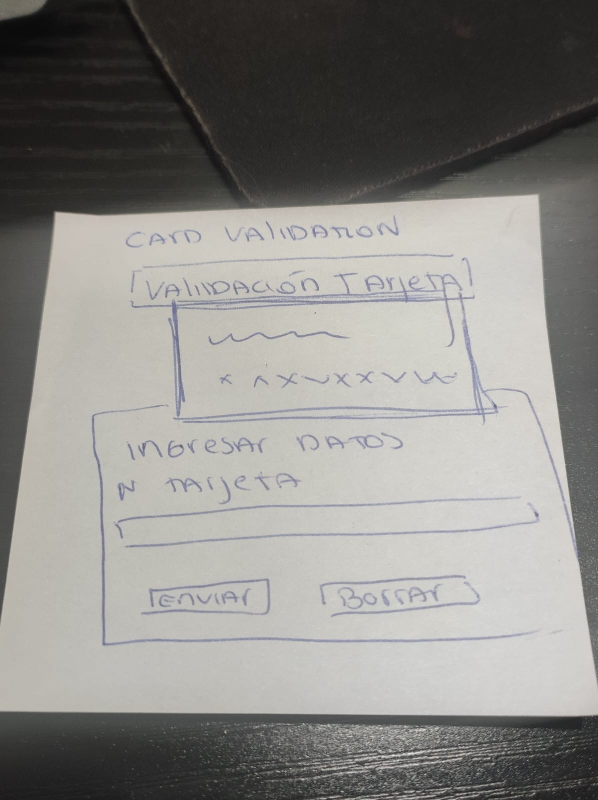
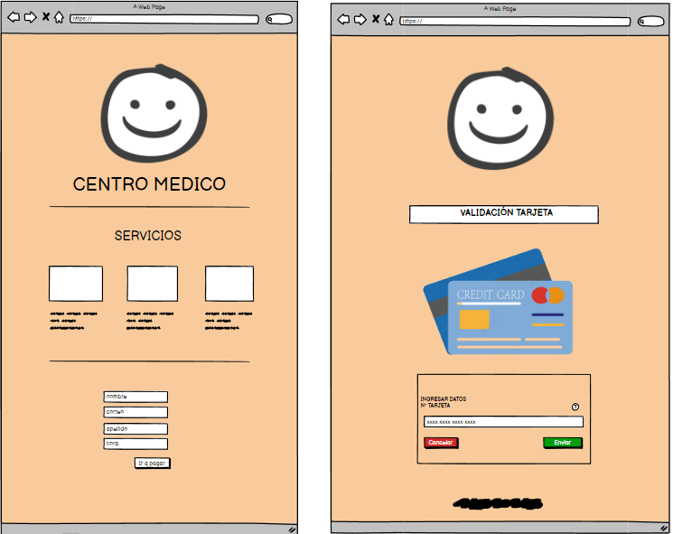

# CENTRO MEDICO ESPERANZA DE VIDA

Aplicación web para un centro medico, donde los pacientes podrán agendar su hora médica y validar su tarjeta de credito para efectuar el pago. 

## Investigación UX 

1. Usuarios y objetivos:
Centro médico Esperanza de vida esta dirigido a personas que buscan algún tipo de asistencia médica. Personas de todas las edades y estatus económico que buscan un centro íntegro y que ofrezca grata atención. 
La principal caracteristica de este centro médico es la entrega de un excelente servicio al paciente y a sus necesidades personales. 

2. Solucion problema/necesidad 
Este sitio web esta destinado a entregar una herramienta de agendamiento de horas médicas mediante el cual se pueda realizar la reserva de hora y efectuar el pago en un mismo lugar y en la comodidad del hogar. 

3. Primer prototipo 

4. Prototipo final 

## VERSIÓN FINAL SITIO WEB

